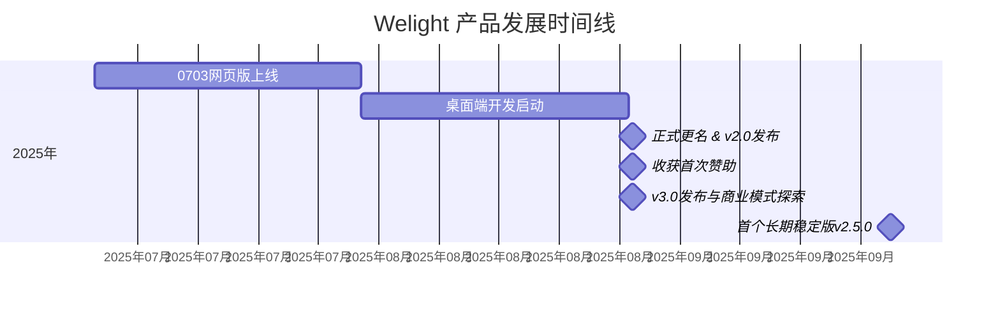

## 赞助致谢

### 发展历程

**Welight 发展时间线**

---

### 致谢名单

Welight 能坚持到现在。要特别鸣谢下面这些赞助者。

| 赞助者     | 金额   | 时间             | 渠道       | 留言                   | 标识       |
| ---------- | ------ | ---------------- | ---------- | ---------------------- | ---------- |
| 君卓       | ¥50.00 | 2025/09/28 17:38 | 收钱码收款 | 聊表心意，希望做大做强 | 先行者     |
| 哥布林医生 | ¥20.00 | 2025/10/13 08:19 | 微信转账   | 支持一下               | -          |
| 源         | ¥9.90  | 2025/11/13 15:40 | 收钱码收款 | 喵杯桌式努力中~        | -          |
| \*洋       | ¥5.00  | 2025/09/19 18:05 | 收钱码收款 | 支持大佬，一点小心意   | 首位赞助者 |
| 余无名     | ¥5.00  | 2025/09/20 13:23 | 收钱码收款 | 感谢为爱发电           | -          |

---

### 未来展望

- [ ] 完善增强主题系统，或将抽离为插件方式运行，提供主题创建面板，支持用户开发自己的主题。
- [ ] 集成豆包 AI 大模型，AI 力量再增强；
- [ ] 深度优化 AI 创作功能，尽可能去掉 AI 文章被打标的问题。
- [ ] 新增图片排版模块，图片的展示方式不再是传统的上下布局，组合更多样。
- [ ] 编辑器再优化，支持更友好、丝滑的编辑和排版体验支持。
- [ ] 完成云存储可选付费模式，给用户更多一个选择。

持续变强中...

> [!IMPORTANT]
>
> 尽管目前我们的官网已交由我们新的合作伙伴维护。但`Welight`绝大部分的核心工作仍由开发者一个人承担以及经费限制等原因，新功能的诉求排期和版本迭代的速度可能不会那么快，感谢理解。
